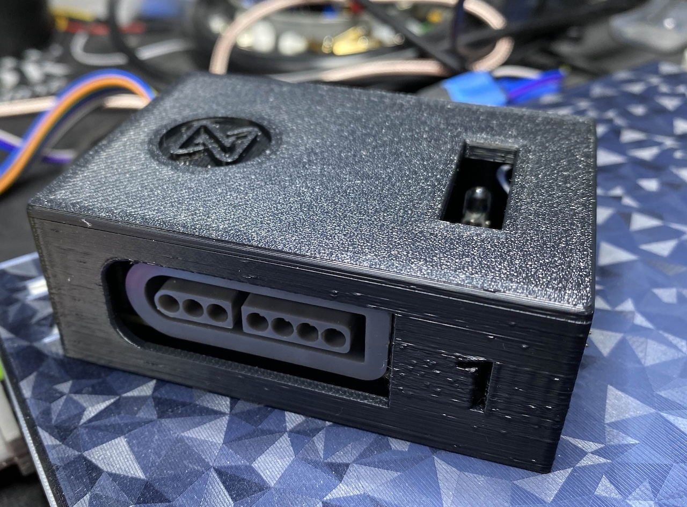
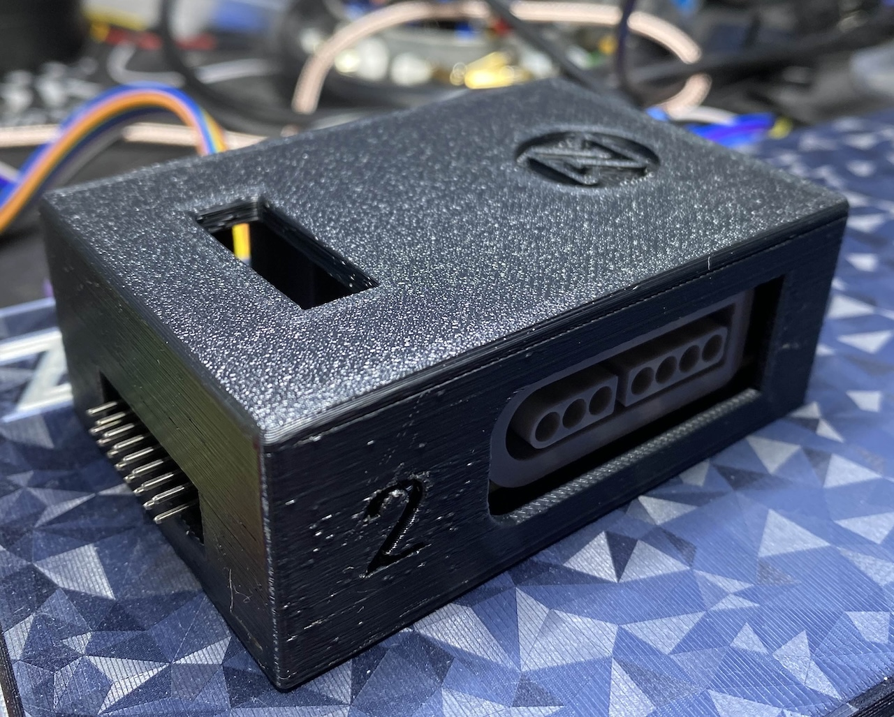
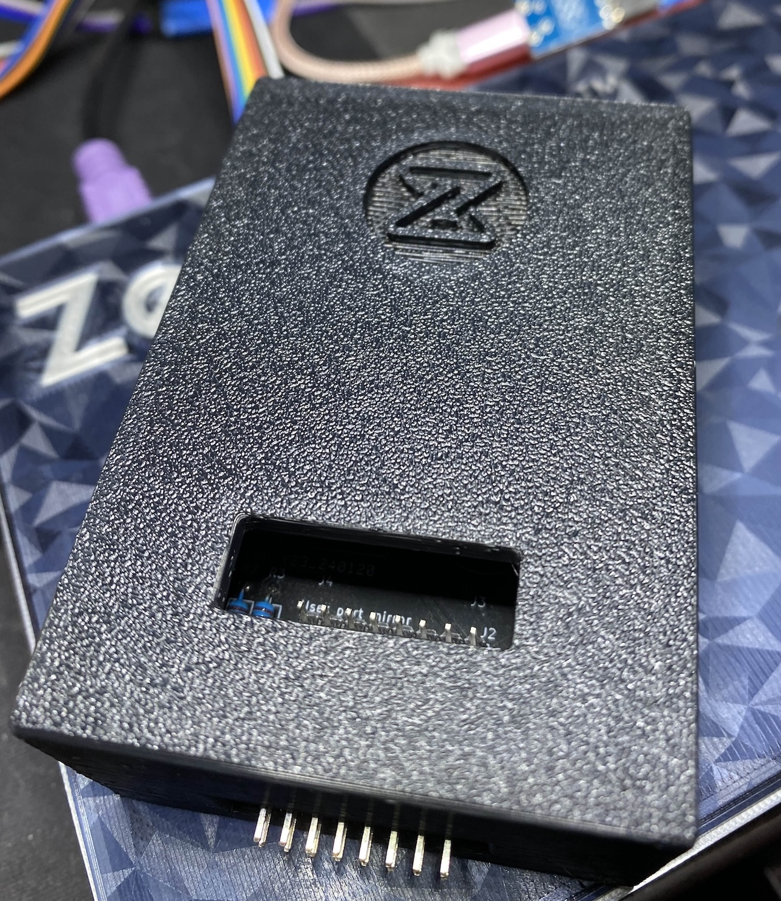

# Zeal SNES Adapter 3D Case

## Required Hardware

You will need 4 M2x14mm (up to M2x18mm) screws/bolts to hold the
case together.

There are two lid options, one that uses M2 Heat-set inserts
and the other that just has M2 holes that require forcing an M2
bolt screw into it.  The manual option is a one-time use option as
M2 has a very fine threading and unscrewing it will likely destroy
the threading.

Heat-set Inserts are recommended.

The following two Amazon links (non-affiliated), are the products
used by me when designing the case

[M2 Screws](https://www.amazon.com/gp/product/B0BYZ9V6KQ) | [Heat Set Inserts](https://www.amazon.com/gp/product/B0CZRD2Y49)

## Print Settings

**Suggested print settings**

* 0.4mm Nozzle
* 0.2mm Layer Height
* Enable Supports (tree)
  - disable supports on the embossed logo
* Random Seam
* No Brim

## Photos

